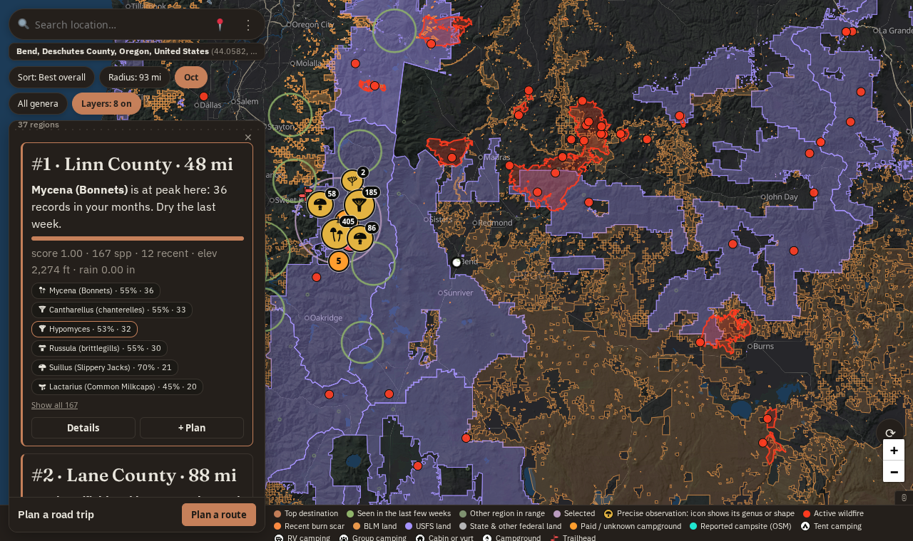

# Foray Planner

[](https://github.com/jahrik/foray-planner/actions/workflows/ci.yml)
[](https://github.com/jahrik/foray-planner/actions/workflows/cd.yml)
[](https://forayplanner.com)

A trip-planning tool for mushroom hunters. Point it at where you are or want to go,
and it tells you which areas near you are most likely to be fruiting this month
and points you to the closest hiking trail, campsite, BLM & FS land near that area.


*See it in action. New here? Read [Getting started](docs/tutorials/README.md#1-getting-started).
More step-by-step guides, including tracking down a specific mushroom from trail to campsite:
[How to use Foray Planner](docs/tutorials/README.md).*

> **No identification or edibility claims are made here.** This is a trip-planning
> and mapping tool only. Every species links to its
> [iNaturalist](https://www.inaturalist.org) page for that kind of information.
> Always verify with an expert before eating anything you find.

---

## What it does

Foray Planner pulls real, research-grade observation records from
[iNaturalist](https://www.inaturalist.org), the world's largest nature-observation
database, and turns years of accumulated field data into a single answer-first flow:
*given where you are, the season, and what you're hunting, where should you go?*

It is built around four questions, in this order:

1. **When and where are my target fungi active?** A ranked list of regions for the months you pick.
2. **Where can I camp, ideally for free?** Campgrounds and dispersed sites closest to that activity.
3. **Which trails put me closest to the mushrooms?** Trails and forest roads ranked by the finds along them.
4. **How do I string several spots into a drive?** A shortlist that becomes a multi-stop trip.


### Where should I go this month?

The default on load. The map fills with destination markers ranked by historical fruiting activity
for the months you chose, and the ranking updates as you change months, radius, sort, genera or
location. The panel shows the **top three** as full cards; **"Show N more regions"** opens the rest.

Each card shows its rank and distance (the title backfills with a notable place name once looked
up), a plain-language **"why"** sentence (the top genus, where the season sits for it, recent
rain, a nearby-fire note, and a close trailhead or free camp when there is one), a score bar,
a stat line (score, species count, recent records, mean ground elevation, recent rainfall), genus
chips linking to iNaturalist, and two actions: **Details** and **+ Plan**.

The score is phenology-first, then nudged by nearby wildfire, burn scars (for morels) and how
reachable the spot is. It summarizes *past iNaturalist records*, not a forecast; the exact
formula is in [How destinations are ranked](docs/scoring.md).

**Markers** read by rank rather than all looking alike:

- **Top 3**: a filled rust circle with a permanent rank numeral
- **Next 7**: a rust ring
- **The rest**: a small dim moss-green dot
- **Green**: your selected genera were recorded there in the last few weeks
- **Purple ring**: the region you have selected, snapped to its true footprint

Selecting a card snaps that circle to its real-world footprint, drops every other circle to a ring so
the basemap stays readable, and drops verified-location observation pins inside it. A cluster badge
shows the commonest genus's icon and a count; hover or tap it for a list of finds, each linking to
iNaturalist, or open a single find for its photo, date and **Directions**.

### Details view

**Details** on a card swaps the panel to a dedicated view with five tabs; **Back to results** returns
to the list:

| Tab | What it shows |
|---|---|
| **Calendar** | Which genera have been recorded here in each month, and how many. Good for "is late October really the right time, or should I wait until November?" |
| **Photos** | Recent research-grade finds. Only Creative Commons photos show a thumbnail, with the photographer's credit. |
| **Trails** | Trailheads, paths, forest roads and named routes, ranked by relevance (named routes, length, and how many finds of your target genus lie within 500 m of the line) rather than raw distance. Selecting one draws the whole trail, coloured by foraging density; a gated-but-walkable forest road is flagged *walk-in*. |
| **Campgrounds** | Developed campgrounds (Recreation.gov) and reported sites (OpenStreetMap), free first, with a parsed nightly fee range and whether they are reservable. |
| **Public land** | Who manages the ground nearby. Pick a parcel as a trip stop. |

| Calendar | Trails |
|---|---|
|  |  |

### Active now: what's been spotted recently?

The **Sort** pill offers *Best overall* (the scored ranking), *Active now* and *Nearest*. **Active
now** switches to areas where your genera were actually observed in the trailing few weeks: no
historical averaging, just what has been found lately. Each chip links to the iNaturalist
observation and flags obscured (location-fuzzed) sightings.

---

## Layers

Every map overlay lives behind one **Layers** pill. Land, fire and imagery apply to the whole map;
campgrounds, dispersed sites and trailheads are drawn inside whichever destination you have
selected.

| Layer | What it shows | Default |
|---|---|---|
| **Campgrounds** | Developed campgrounds from Recreation.gov, with camp-type icons | On |
| **Dispersed** | Backcountry and dispersed sites tagged in OpenStreetMap | On |
| **Free only** | Limits both camping layers to sites with an explicit no-fee signal | Off |
| **Trailheads** | Trailhead signposts | On |
| **BLM / USFS / Tribal land / State & other federal land** | Ownership shaded by agency | Off |
| **Fire & burn scars** | Active wildfire perimeters and recent burn scars (NIFC, RAVG) | Off |
| **Aerial imagery** | Fills the selected region with Esri satellite photos plus place labels | Off |
| **Contour lines** | Elevation contours with labels over a hillshade | On |
| **Satellite basemap** | Replaces the whole base map with satellite imagery | Off |



**A note on dispersed camping:** the Dispersed layer shows only sites that someone has tagged as
campable in OpenStreetMap. A tag is not a guarantee of legality or current access. Ownership
polygons show who manages the land and are informational only. Always check with the local BLM
or Forest Service district office before camping somewhere unfamiliar.

The [map guide](docs/tutorials/README.md#7-reading-the-map) walks through the legend, marker ranks,
land, fire and aerial imagery with screenshots.

---

## Controls

The floating shell over the map has a **search bar** (with a **⋮** menu), a row of **filter pills**,
and the results panel.

| Control | What it does |
|---|---|
| **Search bar** | Type a place (`Coos Bay, OR`) or raw `lat,lng`. The **📍** button uses your device's location. Clicking the map also sets your location. |
| **Sort** pill | *Best overall*, *Active now* or *Nearest*. |
| **Radius** pill | Search radius presets (50, 150, 300, 500 km) from your location. |
| **Months** pill | Any combination of months. The current month is the default. Hidden under *Active now*. |
| **Taxa** pill | Search any rank - a species, genus, family, order or class, by scientific name, common name or synonym - and pin your targets. Empty means every fungus nearby. |
| **Layers** pill | Every map overlay, above. |
| **⟳** (on the map) | Re-pulls the latest iNaturalist observations for your area. Runs in the background with a progress bar. |
| **⋮ > Units** | Miles (default) or kilometres for every distance, elevation and rainfall figure. |
| **⋮ > Theme** | Dark (default) or light; the basemap follows. |
| **⋮ > Text size** | Larger type across the whole panel. |

Your location, selected genera and months are remembered, with no account: each browser gets an
anonymous device id.

---

## Mobile

On narrow screens the map goes full-screen and the panel becomes a draggable bottom sheet
(collapsed, half, full); drag the handle to expand it and Back collapses it instead of leaving the
page. On desktop the results sit in a slide-out dock. You can add the site to your home screen to
open it like an app.


---

## Plan a road trip

Tap **+ Plan** on any card to add it to a shortlist, then **Plan a route** on the bar at the bottom
of the panel. You can set a **Start** (default: your location) and a **Destination** (blank
auto-picks the best reachable region); shortlisted regions become required stops, and **Max stops**,
**Max leg** and **Free camp** tune the rest. Each stop lists its drive distance, what is fruiting, a
nearby camp and a trail, and warns about an active fire. In a region's **Details** you can pin a
specific campground, trail or public-land parcel as that stop's exact point.


Export it as **GPX** for any maps app, as JSON, or open it in **Google Maps**. Legs follow the
straight line between stops, not real roads; see [AGENTS.md](AGENTS.md) for why. `foray plan` and
`GET /api/plan` do the same headless.

---

## Quick start

```bash
uv tool install rust-just    # one-time: the `just` command runner
just install && just db
just ingest             # pull recent iNat observations nationwide (needs network)
just start              # http://localhost:8000 (app + postgres + vector-tile server)
just scheduler          # optional: the background job loop (jobs.yaml)
```

Run `just check` before pushing (lint, type-check and tests), and `just frontend` after touching
`frontend/`. The [development guide](docs/development.md) has the details, and `just` with no
arguments lists every recipe.

---

## Documentation

Start at the [documentation index](docs/README.md). Highlights:

| If you want to... | Read |
|---|---|
| Use the app, with screenshots and animations | [How to use Foray Planner](docs/tutorials/README.md) |
| Set up a dev environment, run tests, change the code | [Development guide](docs/development.md) |
| Understand how the pieces fit | [Architecture](docs/architecture.md) |
| Know exactly how a score is computed | [How destinations are ranked](docs/scoring.md) |
| Call the HTTP API | [API reference](docs/api.md) |
| Change the web client | [Frontend guide](docs/frontend.md) |
| Run or add a scheduled job; read health checks and metrics | [Jobs and observability](docs/jobs.md) |
| Find a command or an environment variable | [CLI](docs/cli.md), [Configuration](docs/configuration.md) |
| See every external dataset, its licence and limits | [Data sources](docs/data-sources.md) |
| Deploy to production | [Deployment](docs/deployment.md) |

---

## Attribution

Observation data (c) [iNaturalist](https://www.inaturalist.org) contributors (CC BY-NC); photos carry
their own per-photo licence and attribution, shown under each thumbnail, and only Creative
Commons-licensed photos are displayed. Map data (c) [OpenStreetMap](https://www.openstreetmap.org)
contributors (ODbL) via [Protomaps](https://protomaps.com); trails and dispersed camping also from
OpenStreetMap. Campgrounds from the [Recreation.gov](https://recreation.gov) RIDB API. Land
boundaries, trails, forest roads and burn severity from the U.S. Forest Service, BLM and USGS;
wildfire perimeters from NIFC. Geocoding (c) OpenStreetMap / Nominatim. Elevation from the
Copernicus DEM and rainfall from ERA5, both via [Open-Meteo](https://open-meteo.com); terrain
shading from Tilezen (USGS 3DEP and others). Satellite imagery (c) [Esri](https://www.esri.com).
The complete, audited list with each provider's terms is in [Data sources](docs/data-sources.md#licences-and-attribution).

---

## License

[MIT](LICENSE)
