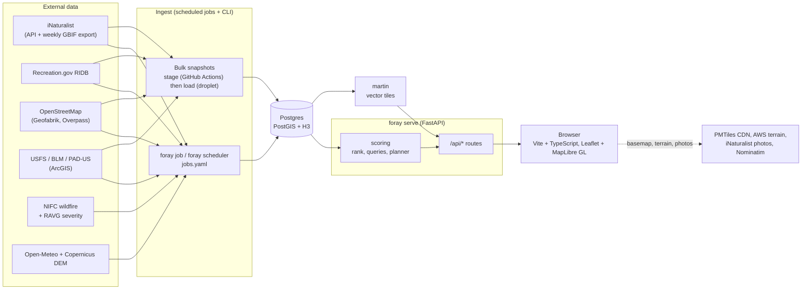
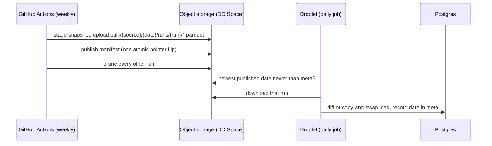
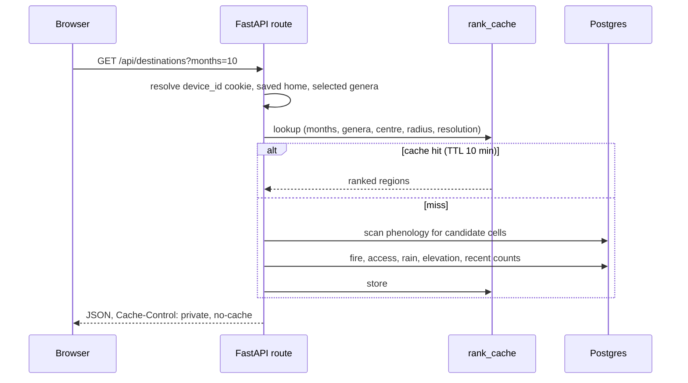

# Architecture

How Foray Planner is put together: where data comes from, how it is stored and ranked, what
serves it, and what keeps it fresh. This is the map to read before changing anything; the
other pages go deep on one part each.

| If you want... | Read |
|---|---|
| Every HTTP route | [api.md](api.md) |
| How a score is computed | [scoring.md](scoring.md) |
| The scheduled jobs, health checks and metrics | [jobs.md](jobs.md) |
| The web client | [frontend.md](frontend.md) |
| Every setting and environment variable | [configuration.md](configuration.md) |
| Every `foray` command | [cli.md](cli.md) |
| Each external dataset, its licence and limits | [data-sources.md](data-sources.md) |
| Production infrastructure | [deployment.md](deployment.md) |

---

## The idea in one paragraph

iNaturalist holds millions of dated, located fungi observations. Foray Planner caches the
research-grade ones in Postgres, rolls them up into **how many records each genus has in each
month in each hexagonal cell of the map** (the *phenology* table), and ranks cells for the months
and genera you pick. Around that sit layers answering the follow-up questions: which trails and
forest roads lead there, where a campground or free dispersed site is, who manages the land, and
whether a wildfire is near. A trip planner strings several cells into a drive. The app **never
calls a third party while you use it** (with two small exceptions below); every dataset is
ingested ahead of time by scheduled jobs.

## System overview



Two deliberate exceptions to "no live third-party calls":

1. **Place search and place names** go through Nominatim (server-side, throttled, cached).
2. **The first time a map popup asks for a photo**, the server fetches one Creative Commons image
   from iNaturalist and caches the answer (including "none") in Postgres for 30 days.

The browser itself loads the vector basemap (a PMTiles archive on a CDN), terrain tiles and
iNaturalist photos directly; the Content-Security-Policy in
[`api/security.py`](../src/foray/api/security.py) lists exactly those hosts.

## Repository layout

```
src/foray/
  cli.py              Click CLI: every `foray ...` command
  config.py           pydantic-settings: FORAY_* env vars -> Settings
  defaults.py         built-in home, H3 resolution, 50-state coverage list
  refresh.py          the shared home-radius refresh sequence (CLI + API)
  jobs.py, schedule.py, alerting.py, metrics.py   scheduled-job runner, dev scheduler, alerts, /metrics
  ingest_bulk.py      bulk-snapshot registry + stage/load pipeline    spaces.py = object storage
  geo.py              pure lat/lng + H3 math (no I/O)
  genus_icons.py      which icon each genus gets
  api_models.py       pydantic response models (the OpenAPI schema)
  api/                FastAPI app: app.py, deps.py, security.py, state.py, routes/*
  cache/              Postgres schema, migrations, idempotent upserts, ingest log, job runs
  scoring/            ranking.py, regions.py (phenology), queries.py (read repository),
                      planner.py, trend.py, rank_cache.py, models.py, _sql.py
  sources/            one module per external dataset + the ingest layer built on them
frontend/             the web client (see frontend.md)
infra/ansible/        production provisioning and deploy (see deployment.md)
infra/docker/postgres local-dev Postgres image (PostGIS + h3)
jobs.yaml             the single list of scheduled jobs
docs/                 these docs; docs/tutorials/ holds the illustrated user guides
tests/                pytest suite (hermetic: no network)
```

### The packages

- **`sources/`** is everything that talks to a third party and lands the result in the cache:
  `inat` (observations, genus catalog, photos), `ingest` (the observation ingest, plus the
  re-check passes `revalidate` and `resync`), `geocode` (Nominatim), `camps` (RIDB),
  `dispersed` (OSM camp tags), `trails` (OSM via Overpass), `osm_trails` (OSM via Geofabrik
  extracts), `usfs_trails` and `usfs_mvum` (Forest Service trails and motor-vehicle-use roads),
  `land` (BLM, USFS, PAD-US and tribal ownership), `fire` and `ravg` (NIFC perimeters, burn
  severity), `elevation` / `elevation_dem` / `precip` (Open-Meteo and Copernicus), and
  `satellite` (Esri imagery). `http`, `overpass` and `ingest_base` are the shared plumbing.
  [data-sources.md](data-sources.md) documents each one's licence, limits and quirks.
- **`cache/`** owns the schema and every write. Writes are idempotent upserts so any job can be
  re-run safely. `core.py` holds the `SCHEMA` and the numbered `_MIGRATIONS` chain; the other
  modules group writes by domain (`observations`, `campsites`, `land_trails`, `fire_cache`,
  `genera`, `precip_cache`, `region_cache`, `backfill_queue`, `ingest_log`, `device_prefs`).
- **`scoring/`** is read-mostly. `regions.py` materializes `phenology`; `ranking.py` ranks
  cells; `queries.py` answers the point-and-radius questions (camps, trails, land, fire,
  calendar, photos, alerts); `planner.py` builds trips. See [scoring.md](scoring.md).
- **`api/`** is a thin HTTP layer: one `APIRouter` per domain under `routes/`, shared request
  helpers in `deps.py`, headers and limits in `security.py`.

---

## Regions and the H3 grid

A *region* (a "destination" in the UI) is an [H3](https://h3geo.org) hexagonal cell. The
resolution is `FORAY_H3_RESOLUTION` (default **4**: about 26 km edge length, roughly
1,770 km² per cell, chosen by comparing phenology density on real data). Every observation maps
to a cell with `h3_lat_lng_to_cell(POINT(lng, lat), resolution)`, and the cell's hex string is its
`region_id`. Nothing stores the cell id redundantly: it is derived in SQL by the `BINNED`
fragment in [`scoring/_sql.py`](../src/foray/scoring/_sql.py).

Two things to know:

- H3's `POINT` argument order is **(lng, lat)**, the reverse of the function name. Swapping them
  returns a valid-looking but wrong cell, so tests exercise it directly.
- Hexagons have equal-distance neighbours and, unlike the old square degree grid, do not stretch
  with latitude. Camping and trails use the *same* cells and the same `haversine_km` distance, by
  design; there is no second geography.

Changing the resolution means re-running `foray refresh` so `phenology` and `regions` are
rebuilt at the new size.

## Data model

Postgres 15 to 17 with the **PostGIS**, **h3**, **pg_trgm** and **pg_prewarm** extensions
(the local image and the DigitalOcean managed cluster both provide them). The schema lives in
[`cache/core.py`](../src/foray/cache/core.py): a baseline `SCHEMA` plus a numbered
`_MIGRATIONS` chain recorded in `schema_migrations`. `foray migrate` (and the API on startup)
applies it; see [Migrations](#migrations).

| Table | Holds |
|---|---|
| `observations` | Cached iNaturalist records: id, taxon, lat/lng, date, `quality_grade`, `obscured`, place, URI, `elevation_m`, antecedent rain, `geom` |
| `observation_thumbnails` | One cached Creative Commons photo (or "none") per precise observation |
| `fungi_genera` | The Fungi genus catalog (about 6,000 rows) with taxonomy used for icons |
| `phenology` | **Materialized.** Count per (region, taxon, month) |
| `regions` | **Materialized.** Per-cell centre, mean elevation, mean rain, observation and taxa counts |
| `campsites` | Developed campgrounds (RIDB) and OSM-reported dispersed sites, with `camp_type` and `free` |
| `campsite_duplicates` | Tombstones so a folded duplicate is not re-inserted |
| `trails`, `trail_geometry` | Paths, forest roads, hiking routes and trailheads (OSM, USFS), geometry kept apart so list reads stay small |
| `trail_duplicates` | Tombstones for OSM trails merged into their USFS twin |
| `public_land`, `public_land_parts` | Ownership polygons (BLM, USFS, PAD-US, tribal) and a subdivided copy for fast joins |
| `fire_perimeters` | Active wildfire perimeters and recent burn scars |
| `precip_daily`, `precipitation` | Per-cell daily rain cache and the recent-rain-per-destination layer |
| `region_places`, `region_satellite` | Per-cell caches that never need re-resolving: the place name and the Esri raster |
| `ingest_log` | Which area/window was fetched and when (coverage tracking, freshness) |
| `job_runs` | One row per scheduled-job attempt: status, duration, rows |
| `backfill_queue` | Activity-weighted queue for the elevation and rain backfills |
| `app_location`, `app_genera` | Per-device saved home and selected genera |
| `meta` | Small key/value state (loaded bulk-snapshot dates, phenology-rebuild counters) |

The whole database is rebuildable by re-running the ingest jobs **except `app_location` and
`app_genera`**, which are visitor-authored. In production they live on the managed cluster; nothing
in this repository backs them up beyond the provider's own policy (see
[deployment.md](deployment.md)).

### Research grade only

Only `quality_grade = 'research'` observations count. That filter is enforced centrally in
`BINNED`, not trusted from the API query that fetched them, so a row that arrived some other way
(a bulk load, a manual insert) still cannot leak into scoring.

### Obscured observations

iNaturalist deliberately blurs the location of sensitive records. Foray Planner never presents
a blurred point as a find:

- A region's displayed centre averages **only precise points** (falling back to the blurred ones
  only if every record in the cell is blurred).
- Map pins and popups come from `obscured = FALSE` rows only. Whether a cached row is really
  precise is confirmed against iNaturalist by `resync` (a bulk import never sets `obscured`).
- The "Active now" list still counts blurred sightings but flags them ("fuzzy").

### Materialized tables and the rebuild

`phenology` and `regions` are not in the baseline schema: `build_phenology`
([`scoring/regions.py`](../src/foray/scoring/regions.py)) creates them with build-and-swap. It
aggregates into `*_new` tables, builds indexes and runs `ANALYZE` outside any transaction (so
reads keep working), then swaps names in a transaction that blocks readers for milliseconds. A
session advisory lock serializes concurrent rebuilds, `pg_prewarm` warms the new tables, and the
in-process ranking cache is cleared.

Because a rebuild is the heaviest single operation, jobs do not run it after every pass:
`cache.maybe_rebuild_phenology` accumulates changed-row counts in `meta` and rebuilds only past
`FORAY_OBSERVABILITY__PHENOLOGY_REBUILD_THRESHOLD` (default 50). While a user-triggered
`mushrooms` refresh is rebuilding, read routes answer `409`.

### Migrations

`_MIGRATIONS` is an append-only list of `(version, sql-or-callable)` pairs, applied in order and
recorded in `schema_migrations`. Rules that exist because they were learned in production:

- Do not run table-wide geometry or spatial-join work inside a migration: it runs synchronously
  during deploy and blocks the app. Scope it to the per-ingest call, or run it as a detached
  container.
- `foray migrate` is the one-shot step CD runs before any container using the new image starts,
  so the API and the job containers do not race a schema-breaking change.
- A job container pulls `:latest` on every tick so a stale image cannot fail `apply_schema` against
  a newer schema.

---

## Ingest

All writes happen outside the request path.

### Observations

`sources/ingest.py` pulls **every Fungi observation** for a place (the home radius, a coverage
region, or a whole country) in one query, and resolves each record's **genus** from its taxon
ancestry, so phenology is per actual genus rather than a fixed target list. Incremental runs
re-fetch a small overlap window; a pull is recorded in `ingest_log` so the same area/window is
skipped next time. Rows are written in 5,000-row chunks to keep memory bounded.

History is loaded in bulk instead (next section). Three re-check passes keep the cache honest:

| Pass | What it fixes |
|---|---|
| `revalidate` | A handful of fungal genera share a name with an animal genus (fungal *Olla* vs. the ladybug genus). If the cached count for a genus drifts from iNaturalist's live count, re-fetch just those rows and purge or reassign anything no longer Fungi. |
| `resync` | A slow, hourly sweep of the **whole** table, oldest-checked first. The only path that eventually verifies every column, including `obscured`, and catches a misidentification too rare for `revalidate`'s ratio to flag. |
| backfills | Elevation (`backfill-elevation-dem`, with the Open-Meteo `backfill-elevation` as a safety net) and antecedent rain (`backfill-precip`), drained from the activity-weighted `backfill_queue` so cells people actually look at fill first. |

### The three delivery patterns

Choosing how a new dataset reaches the database is the most important ingest decision. Ask
whether it is a *national, authoritative* dataset that changes slowly:

| Pattern | Use for | How |
|---|---|---|
| **Bulk snapshot** | National datasets (iNaturalist history, RIDB, USFS trails and roads, OSM trails, RAVG) | A *stager* runs in GitHub Actions weekly and uploads a Parquet snapshot to object storage; a *loader* on the droplet loads the newest one (`foray ingest-bulk`). Details below. |
| **Area ingest** | Small, incremental or interactive sources (campgrounds, dispersed camps, land, trails near the home radius) | `run_area_ingest` in `sources/ingest_base.py`: skip if the area is already covered, fetch, upsert, record. |
| **Replace lane** | Data where the source dropping a record means it is gone (active wildfires) | `cache.replace_fire_lane` deletes rows the source no longer lists. |

### Bulk snapshots



Staging happens off the droplet because a source can be tens of gigabytes. Every run uploads
under its own run-unique prefix and only then publishes a manifest, so a re-staged date or two
overlapping runs can never produce a half-written read. Loaders either swap a whole staging table
in (`copy_and_swap`) or, for the trails sources, write only the rows that changed (a diff load).
Sources are registered in `STAGERS` and `LOADERS` in
[`ingest_bulk.py`](../src/foray/ingest_bulk.py); the weekly workflow stages whatever is
registered, so there is no second list to keep in sync. More in
[data-sources.md](data-sources.md#bulk-snapshot-ingest-pipeline-issue-334).

---

## Serving

### Request path



- **Connection pool.** `psycopg_pool` with 2 to 10 connections, each running
  `statement_timeout = 5s` so a runaway query cannot hold a connection. The pool is deliberately
  small: the managed database caps all backends at 22, shared with the job containers. Startup
  and refresh checkouts lift the timeout for their own long work, and the pool restores it when the
  connection is returned.
- **Thread pool.** Routes are plain `def`, run in AnyIO's pool, capped at 12 tokens so surplus
  requests queue and then fail fast on the pool timeout instead of dog-piling the database.
- **Ranking cache.** `scoring/rank_cache.py` is an in-process LRU (500 entries) with a 600 s TTL,
  cleared on every phenology rebuild and on writes to trails, camps, land and fire. It is a plain
  module-level dict **because `foray serve` runs a single uvicorn process**; running several
  workers would need a shared cache or cross-process invalidation.
- **No accounts.** A visitor is an opaque `device_id` cookie. Saved home and selected genera hang
  off it. See [api.md](api.md#anonymous-device-identity).
- **Refresh.** `POST /api/refresh` runs the same `run_home_refresh` the CLI uses in a background
  thread and streams progress over server-sent events.

### Vector tiles and imagery

Trails, public land and fire polygons are drawn from **vector tiles**, not GeoJSON over JSON: a
[martin](https://martin.maplibre.org) container reads the PostGIS tables and the app proxies its
tiles same-origin (`/api/tiles/{trails,land,fire}`), so the browser never talks to an internal
host. The base map is a Protomaps PMTiles archive read directly from a CDN. Aerial imagery
comes from Esri's tile pyramid, either proxied tile by tile for the full-map satellite basemap or
stitched once per destination and cached in `region_satellite`. The rule behind this is
**prefer a provider's tile pyramid over a dynamic render**; it is spelled out in `AGENTS.md`.

### The web client

A Vite + TypeScript single-page app with a Leaflet map (MapLibre GL draws the vector basemap and
the trail, land and fire layers inside it), built into `src/foray/web/dist/` and served by the
same FastAPI process. Types come from the backend's OpenAPI schema, so a route change that is not
mirrored in the client fails the build. See [frontend.md](frontend.md).

---

## Operations

- **Scheduling.** [`jobs.yaml`](../jobs.yaml) is the single list of scheduled work. The dev loop
  (`foray scheduler`) and production's systemd timers both read it, so they cannot drift. Every job
  runs through `foray job`, which adds an overlap guard, a `job_runs` row, a writer-cap
  semaphore, healthcheck pings and failure alerts. See [jobs.md](jobs.md).
- **Health and metrics.** `/healthz` (liveness), `/healthz/data` (is each layer fresh),
  `/healthz/backlog` and Prometheus `/metrics`. See [jobs.md](jobs.md#observability).
- **Deploy.** Every push to `main` builds a multi-arch image, publishes it to GHCR and deploys it
  to a DigitalOcean droplet (Docker, Caddy, systemd timers) in front of a managed Postgres
  cluster, behind Cloudflare. See [deployment.md](deployment.md).
- **CI.** Python lint, type-check and tests; a fresh-Postgres run of the whole migration chain;
  the frontend type-check, lint, tests and build (plus an API-schema drift check); and a Docker
  image lint and build.

## Design decisions worth knowing

- **Free first.** Dispersed and free camping rank above paid sites, and a site is `free` only on
  an explicit no-fee signal, never guessed.
- **No claims.** The app makes no identification, edibility or safety claim, and does not assert
  that camping is legal anywhere. It shows land ownership and links the official source. Species
  detail lives on iNaturalist, which every taxon links to.
- **No real routing yet.** The trip planner's corridor is a great-circle buffer, not a road route;
  no routing engine is wired in, and adding one is a deliberate future step once a region scope is
  chosen.
- **Dev mirrors prod.** Anything the production pipeline needs must also run on a developer
  machine, which is why the dev scheduler reads the same manifest and local Postgres carries the
  same extensions.
- **Self-healing over manual steps.** Cache keys carry a version (for example the trails query
  version), so a changed query is re-pulled by the normal schedule rather than by a one-time
  "run `--force` on production" step.
