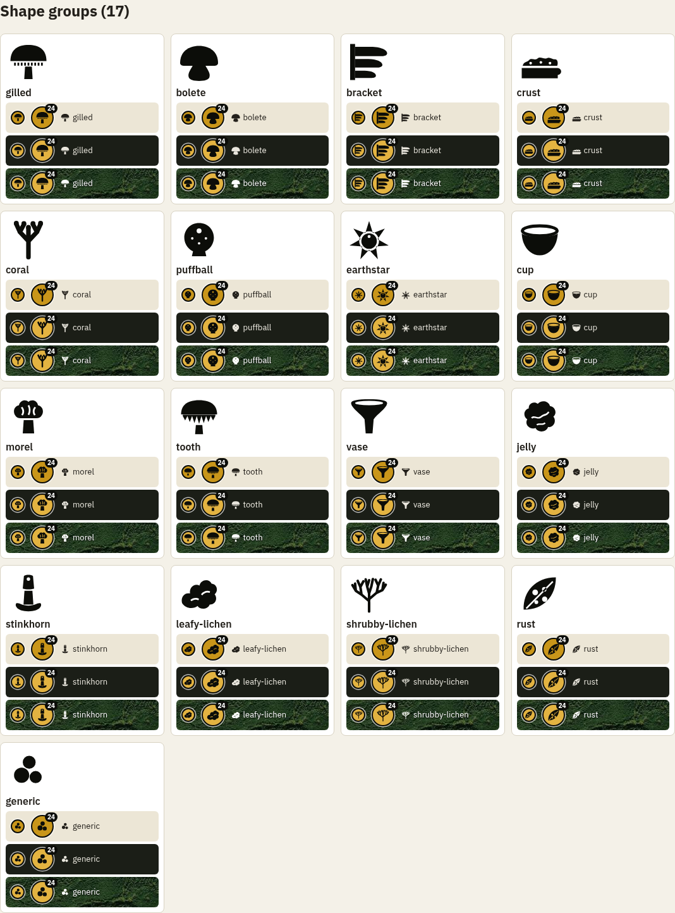

# Frontend guide

The web client lives in [`frontend/`](../frontend). It is a **Vite + strict TypeScript** single-page
app with no UI framework: modules own a part of the DOM, share one `state` object, and talk to the
backend through a typed client. A Leaflet map hosts a MapLibre GL vector basemap. It builds into
`src/foray/web/dist/`, which the FastAPI app serves, so one container ships both halves.

For what each screen does from a user's point of view, see the illustrated
[how-to guides](tutorials/README.md). This page is for people changing the client.

Contents: [run it](#running-and-building) | [layout](#source-layout) |
[how a screen is wired](#how-the-screen-is-wired) | [state and preferences](#state-and-preferences) |
[the map](#the-map) | [views](#views) | [typed API client](#typed-api-client) |
[design system](#design-system) | [genus icons](#genus-icons) | [mobile](#mobile-layout) |
[conventions](#conventions) | [testing](#testing)

---

## Running and building

Node comes from [nvm](https://github.com/nvm-sh/nvm); `frontend/.nvmrc` pins the major version and
the `justfile` puts the matching install on `PATH`.

```bash
just install                  # uv sync + npm ci
just db && uv run foray serve # terminal 1: the API on :8000
cd frontend && npm run dev    # terminal 2: Vite on :5173, proxies /api/* to :8000
```

| Command | What it does |
|---|---|
| `npm run dev` | Hot-reload dev server. Also serves the dev-only icon gallery at `/icons.html`. |
| `npm run build` | `tsc --noEmit` then `vite build` into `src/foray/web/dist/`. |
| `npm run lint` | `eslint` and `prettier --check`. `npm run format` fixes. |
| `npm test` | Vitest (jsdom). |
| `npm run gen:api` | Regenerate `src/api/schema.ts` from the backend's OpenAPI schema. |
| `just frontend` | The CI gate: lint, test, type-check and build together. |
| `just check-api-schema` | Regenerate the types and fail if the committed ones differ. |

**`typescript` is deliberately not a direct dependency.** npm installs it as the shared peer of
`openapi-typescript` and `typescript-eslint`, and that copy provides `tsc`. TypeScript 7's native
compiler no longer exposes the API those two tools drive, so pinning `typescript` directly only
invites upgrades they cannot run. Do not add it back; npm will pull a newer one in once both
tools support it.

The client is also a minimal PWA (`vite-plugin-pwa`): a manifest and a service worker so phones
offer "Add to Home Screen", with **no offline caching** of app data on purpose.

## Source layout

```
frontend/
  index.html            the whole page skeleton: search bar, pill sources, dock, plan form
  public/               icons, manifest assets, theme-init.js (see below)
  icons.html            dev-only icon review gallery
  src/
    main.ts             boot: load /api/config, wire every module, first load
    state.ts            the one flat state object + unit formatters
    prefs.ts            localStorage-backed preferences
    tokens.css          the visual identity: palette, type scale
    style.css           layout and components, built on the tokens
    api/                client.ts (typed fetch), types.ts (aliases), schema.ts (generated)
    map/                Leaflet map, basemap layers, markers, popups, mobile sheet
    views/              the ranked list, Details, Plan, shortlist, sort
    ui/                 pills, popovers, cards, autocomplete, "why" sentence, loading bar
    icons/              genus and campground icon art + lookups
    geolocate.ts, locate-ui.ts   device location
    location.ts, location-writes.ts, refresh.ts, genera.ts   search, saved home, refresh stream, genus picker
```

### Module guide

| Area | Module | Responsibility |
|---|---|---|
| Boot | `main.ts` | Fetches `/api/config`, initializes theme/units/text size, the map, sheet, pills and every control, starts geolocation, and does the first `runDestinations()`. |
| State | `state.ts` | The flat `state` object (`MapState & ScopeState & UiState`), `qs()`, `setStatus()`, distance/elevation/rain/accuracy formatters, `inatUrl()`, `observationUrl()`, `monthsParam()`, `timeWindowParam()`. |
| | `prefs.ts` | Theme, text size, units, months and the "home was set by hand" flag, in `localStorage`. |
| Results | `views/views.ts` | `runDestinations()`: fetch `/api/destinations`, sort, render hero cards and the collapsible remainder; delegates "Active now" to `/api/alerts`. |
| | `views/sort.ts` | The `Sort` labels and client-side reordering (best, active, nearest). |
| | `ui/card-dom.ts` | The single result-card template both lists render through. |
| | `ui/why.ts` | The plain-language line leading each card, built only from the destinations payload. |
| Details | `views/details.ts`, `views/destination-tabs.ts` | The Details view and its five lazy tabs: Calendar, Photos, Trails, Campgrounds, Public land. |
| Trip | `views/shortlist.ts`, `views/plan.ts`, `views/plan-points.ts`, `views/stop-pin.ts` | The "+ Plan" shortlist, the route form and render, GPX/JSON export, and pinning an exact stop. |
| Shell | `ui/pills.ts`, `ui/pill.ts` | The Sort / Radius / Months / Genera / Layers row and its popover primitive. |
| | `ui/ui-prefs.ts` | The units, theme and text-size toggles in the `⋮` menu. |
| | `ui/autocomplete.ts`, `location.ts`, `genera.ts` | Typeahead for place search and the genus picker. |
| Map | `map/map.ts` | Leaflet init, marker palette, legend, theme switching, precise-pin clustering. |
| | `map/destinations.ts` | Destination circles: the rank hierarchy, snapping to true footprint, the aerial overlay. |
| | `map/basemap*.ts` | The MapLibre GL vector basemap and its trails, land, fire, terrain, roads and satellite layers. |
| | `map/layers.ts`, `map/poi-layers.ts` | Camps, dispersed sites, trailheads, precise observations and the selected trail. |
| | `map/sheet.ts` | The draggable mobile bottom sheet. |
| Device | `geolocate.ts`, `locate-ui.ts` | Coarse-plus-GPS location fixes and how a fix may change home. |
| Data | `refresh.ts` | The Refresh button, SSE progress, and "set location". |

---

## How the screen is wired

`index.html` is a static skeleton. Most controls (radius presets, month grid, genus search, layer
checkboxes) sit in a hidden `#pill-sources` block; `initPills()` then **moves** each into its
pill's popover. That ordering is why `initPills()` runs last in `main.ts`: every module that
wires those controls has already found them by id.

A typical interaction:

1. A control handler changes `state` (and persists it through `prefs.ts` where relevant).
2. It calls `onScopeChange()` so the pill labels repaint, and `refreshCurrentView()`
   ([`view-run.ts`](../frontend/src/views/view-run.ts)), the single "re-run whatever panel is
   open" entry point.
3. `runDestinations()` or `runPlan()` calls the API through the typed client, clears and replots
   the map layers, and renders cards into `#panel`.
4. Selecting a card snaps its circle to the real footprint, loads the precise pins and the
   camp/trailhead markers for that circle, and prefetches popup photos in batches.

On boot, geolocation starts immediately but never blocks first paint: if a fix lands within a short
head start (600 ms) the first plot already uses it, otherwise the page paints with the saved home
and a later, better fix may offer to move it. A fix within 1 km of home is applied quietly; a
farther one is applied only if the user has not interacted yet, otherwise it is offered on the
search bar's pin button. A hand-set home (typed search or map click) is never replaced by a
coarse (over 1 km) fix, because a desktop's IP-based guess can be 100 km off.

## State and preferences

[`state.ts`](../frontend/src/state.ts) holds **one flat object** typed as three concerns, so call
sites stay `state.foo` while the shape stays legible:

- `MapState`: live Leaflet layer handles. Written only from `map/`.
- `ScopeState`: what the user is asking about: `home`, `months`, the server-supplied
  `regionRadiusKm`, tile URLs and `recentWeeks`.
- `UiState`: `view` (`destinations` or `plan`), `sort`, `units` and the last plan payload.

Server-side per-device state (the saved home, the selected genera) is not stored here; it is
fetched from the API and cached in the module that owns it.

`localStorage` keys, all read through `prefs.ts`: `foray-theme` (default **dark**),
`foray-text-size`, `foray-units` (default **miles**), `foray-months`, `foray-manual-home`.
`public/theme-init.js` reads the theme and text size in `<head>` to set `data-theme` and
`data-text-size` before first paint; it is an external file so the CSP can stay
`script-src 'self'`. Keep its key names in step with `prefs.ts`.

## The map

The map is a **Leaflet** map; the base layer is a **MapLibre GL** canvas mounted inside it with
`@maplibre/maplibre-gl-leaflet`. MapLibre and its styles are code-split into a `basemap` chunk
that loads in parallel with the first render.

**Basemap.** A [Protomaps](https://protomaps.com) PMTiles archive read from `basemap_url`, with
light and dark styles that swap on theme change. `basemap-theme.ts` raises contrast on the stock
dark theme, `basemap-roads.ts` removes the base theme's own track and path ways, and
`basemap-terrain.ts` adds a hillshade (always on) and contour lines with elevation labels (the
**Contour lines** layer). With no `basemap_url` the map has overlays but no base layer.

**Vector overlays.** Trails and forest roads, public land and fire polygons are MapLibre layers fed
by `/api/tiles/...` (see [api.md](api.md#map-tiles)). `basemap-trails.ts` is the *only* source for
trails and forest roads at every zoom; trail lines are coloured by foraging density, and a
gated-but-walkable ("walk-in") forest road gets its own teal style. Clicking a rendered road reads
its OSM tags straight off the tile (`road-inspect.ts`), with no API call.

**Destination circles** (`map/destinations.ts`) are `L.circle`s in real metres, so they scale with
zoom. The rank hierarchy:

| Rank | Marker |
|---|---|
| Top 3 | Score-sized circle, translucent fill, permanent rank numeral |
| Next 7 | Ring only, fixed radius |
| 11 and beyond | Small dim moss dot |
| Seen in the last few weeks | Green instead of rust |
| Selected | Purple ring snapped to the true H3-cell footprint; all others drop to rings |

**Precise pins.** Verified-location observations inside the selected circle are clustered
(`leaflet.markercluster`). A cluster badge shows the most common genus's icon and a count chip;
hover (or tap on touch) opens a newest-first list, and a single pin opens a card with the
observation's own identification, date, an iNaturalist link, directions, and a Creative Commons
photo fetched lazily and prefetched in batches. Popups are built from DOM nodes with `textContent`,
never from `innerHTML`, so text from external APIs cannot inject markup.

**Camps and trailheads** inside the selected circle are always drawn (`poi-layers.ts`): camp-type
icons on a free / paid / OSM-coloured disc, and trailhead signposts. The Layers pill only hides
them.

**Aerial imagery** is opt-in. When on, selecting a destination fills its footprint with the stitched
Esri image plus a roads-and-labels overlay in its own pane (below the vector layers, so rings and
markers stay on top), clipped to a circle with CSS. It is fetched once per selection and never
re-requested on zoom. The separate **Satellite basemap** layer swaps the whole base map to
Esri tiles with Foray's own vector roads and labels drawn on top.

**Layers pill defaults.** Campgrounds, Dispersed, Trailheads and Contour lines start on; Land
ownership (BLM, USFS, Tribal, State and other federal), Free only, Fire and burn scars, Aerial
imagery and Satellite basemap start off.

**Legend.** `renderLegend()` rebuilds a document element below the map from what is actually
showing: always the destination markers and precise-pin entry; fire, land, walk-in road and the
selected trail's foraging tier only when those are on.

**Attribution** is assembled in `map.ts` and follows each provider's own wording; see
[data-sources.md](data-sources.md#licences-and-attribution). Update it when a layer is added.

**Verify map changes at several zoom levels.** A layer that looks right at the zoom you built it at
can vanish or smear at others.

## Views

**Destinations.** `runDestinations()` renders the top three as full cards, then the rest behind
"Show N more regions". Each card: rank, distance, a notable place name (backfilled once looked
up), the "why" sentence, a score bar, a stat line, genus chips linking to iNaturalist, and the
**Details** and **+ Plan** actions. **Active now** swaps the data source to `/api/alerts` but keeps
the same card shell.

**Details** (`views/details.ts`) replaces the list in `#panel`; **Back to results** restores it from
cache. Its five tabs are fetched lazily, once, through `createLazyLoader`:
Calendar (`/api/calendar`), Photos (`/api/observations/photos`), Trails (`/api/trails`),
Campgrounds (`/api/camps`), Public land (`/api/land`). Selecting a trail fetches its geometry from
`/api/trails/network` and draws it.

**Plan** is a mode, not a tab. The `#route-bar` at the panel's foot appears once the shortlist has
a pick; **Plan a route** enters the mode, `runPlan()` calls `/api/plan` with the shortlist as
`waypoints` and any pins as `pin` parameters, and **Back to results** leaves it. Exports: GPX
(a start waypoint, one waypoint per stop, and the destination), JSON (the raw plan) and **Open in
Google Maps** (a directions link through every stop). All three take each stop's point from
`plan-points.ts` (pin, else camp, else region centre) so they agree. Google Maps drops waypoints
past nine, so the button is disabled beyond that and the GPX export is the way to take a longer
route elsewhere. Single places hand off to a maps app with `geo:` links, the only scheme that
reliably opens the OS chooser.

## Typed API client

`src/api/schema.ts` is **generated** from the backend's OpenAPI schema by `openapi-typescript`.
`api/client.ts` wraps `openapi-fetch`: `getJson`, `postJson` and `deleteJson` throw an `ApiError`
(with the server's `detail`) on a non-2xx response, and `openRefreshStream` is the typed
server-sent-event reader. **Every call goes through it; there is no raw `fetch` anywhere.** Place
search is `GET /api/location/search`, proxied by the server.

`api/types.ts` re-exports schema types under domain names, so renaming a backend field is a
compile error at every use.

Whenever you add or change a route or a response model:

```bash
cd frontend && npm run gen:api   # then commit schema.ts and openapi.json
```

CI runs `just check-api-schema` and fails on any difference, so the client can never drift from the
server.

## Design system

[`tokens.css`](../frontend/src/tokens.css) is the identity, a spore-print palette:

| Token | Used for |
|---|---|
| `--rust` | Destination markers, calendar heat |
| `--moss` | Dim, distant regions |
| `--purple` | The selected region |
| `--flush` | Recency: "seen in the last few weeks" |
| `--spore` | Verified-location pins |

with a ~1.25 modular type scale (large-text mode scales the `--text-*` tokens). Legacy names
(`--bg`, `--panel`, `--accent`, ...) are remapped onto these so `style.css` follows the palette.
Fonts are Fraunces (display) and IBM Plex Sans (body and data), self-hosted via `@fontsource-variable`
and bundled; nothing loads from a font CDN. Theming is `data-theme` on `<html>`. Marker colours are
read from the tokens at runtime and cached per theme, so the map follows the toggle.

A CSS gotcha worth remembering: a class that sets `display` beats the browser's `[hidden]` rule.
When testing visibility, assert `getComputedStyle(el).display`, not the `hidden` attribute.

## Genus icons

Every genus gets a small, stylised **category marker**, not an identification aid. The backend
([`genus_icons.py`](../src/foray/genus_icons.py)) resolves a key for each genus and sends it as
`icon` on every payload: one of **17 shape groups** (gilled, bolete, bracket, crust, coral,
puffball, earthstar, cup, morel, tooth, vase, jelly, stinkhorn, leafy lichen, shrubby lichen, rust,
generic) chosen by the most specific override of genus, family, order, class, then a generic
fallback; and **30 bespoke icons** for the most-observed genera (for example *Amanita*,
*Cantharellus*, *Morchella*). Shape groups describe morphology, not taxonomy.

`GenusIcon` is a `Literal` in the backend, so the generated `schema.ts` carries the union and
[`icons/genus-icons.ts`](../frontend/src/icons/genus-icons.ts) fails `tsc` if a key has no art. Art
is one-colour, path-only SVG in `icons/shapes/` and `icons/genera/`; campsite types
(`tent`, `rv`, `mixed`, `backcountry`, `group`, `equestrian`, `cabin`, plus a generic) live in
`icons/camps/`. To add a bespoke genus: add the key to `BESPOKE_GENERA` in the backend, draw an SVG
named for it, run `npm run gen:api`, and look at it in the gallery (`npm run dev`, then
`/icons.html`), which shows each icon at its three shipped sizes on light and dark.



## Mobile layout

At 780 px and narrower the map is full screen and `#sheet` becomes a draggable bottom sheet with
three detents (collapsed, half, full) driven by Pointer Events and a hand-rolled snap with flick
velocity (`map/sheet.ts`). While the sheet is open past collapsed it owns one history entry, so the
browser or Android Back collapses it instead of leaving the page. A tap on the map first collapses
an open sheet and is swallowed; only a tap on an already-collapsed sheet sets the location.
Above 780 px `#sheet` is `display: contents` and the results live in a slide-out dock.

## Conventions

- **No single-letter variable names**, in any language in this repo.
- Strict TypeScript (`tsc --noEmit` is part of the build). ESLint's recommended presets and
  Prettier are enforced by `npm run lint`.
- All text from an API goes in with `textContent` / DOM nodes. If you must build an HTML string,
  escape with `escapeHtml` from `format.ts`.
- All network access through `api/client.ts`.
- Pure logic goes in leaf modules with no DOM or Leaflet import so jsdom can test it
  (`format.ts`, `trail-attrs.ts`, `plan-points.ts`, `sort.ts`).
- A module that is only a data table or palette says so in a header comment. Every module starts
  with a comment saying what it owns and why it exists.
- The app asserts **no identification, edibility or safety claims**. Species information is
  deferred to each taxon's iNaturalist page; keep it that way in any copy you add.

## Testing

Vitest with jsdom, one `*.test.ts` beside each module it covers (40 files). The suite covers the
pure helpers and the DOM builders: cards, pills, popovers, the "why" sentence, trail banding, the
plan exports, the sheet and the typed client. Leaflet itself cannot load under jsdom, so anything
Leaflet-bound is split so its logic sits in an importable leaf module.

For behaviour a unit test cannot see, drive the real app. The tutorial recorder
([`docs/tutorials/record.py`](tutorials/record.py)) is a working Playwright harness; when checking a
change in a browser, check several zoom levels and both themes, and if a rebuild looks unchanged,
unregister the service worker and hard-reload.
